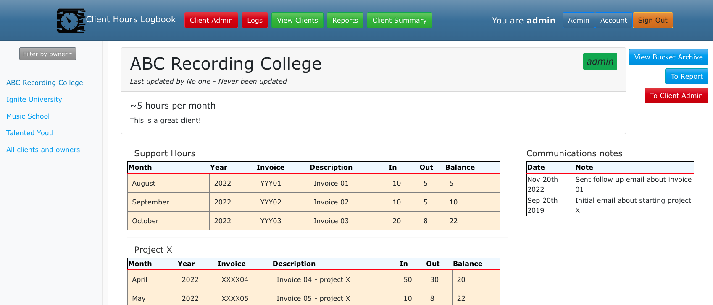

# Client Hours Logbook

Tracks hours billed to clients - different to total hours actually spent on a project.

## Demo Site

Check out a demo at <a href="https://kristian-94.github.io/logbook" target="_blank">https://kristian-94.github.io/logbook </a>

<p>
  
</p>

## Setup

1.  Install docker CE: https://docs.docker.com/install/linux/docker-ce/ubuntu/

2.  Install docker-compose https://docs.docker.com/compose/install/

3.  Clone this code

    ```
    git clone git@github.com:kristian-94/logbook.git
    ```

4. Spin up environment

    ```
    cd logbook
    docker-compose up
    ```

5. Now you should be able to visit the site in your browser at `localhost`
    and log in with username = 'admin' and password = 'admin'


## Local docker compose containers

- Ubuntu 1804 apache webserver for the API
- Ubuntu 1804 node sever for the front end
- Postgres database

## Utility Commands

Use the following command to enter the bash shell of each container.
Replaces using the docker exec function.
Enter web container (react, frontend app):

```
./control web
```

Enter postgres database shell:

```
./control db
```

Enter yii PHP backend container (eg. to run yii commands from command line):

```
./control api
```

## Development vs production build

Prod & dev share the same `db` container service as the database.

### Development

Development uses the `client` and `api` containers specified in the `docker-compose.yml` file.
We separate the backend and frontend into separate containers and mount the front end react
directory `./client:/siteroot` inside the client, so that we can take advantage of hot reloading.
We don't use `npm run build`.

### Production Build

In production, we need the back and front end served from the same origin. This is
achieved with a reverse proxy, some special nginx config to serve the backend at `localhost/api`, and the
front end at `localhost`. This config is found in `docker/build/nginx-site.conf`.

We need to also create the build folder expected in the nginx config at
`root /var/www/site/client/build;`. To create that we manually exec into
the build container and run `npm run build` to build a prod react app.

The reason we wouldn't do development using this `build` container is because we have
no hot reloading.
